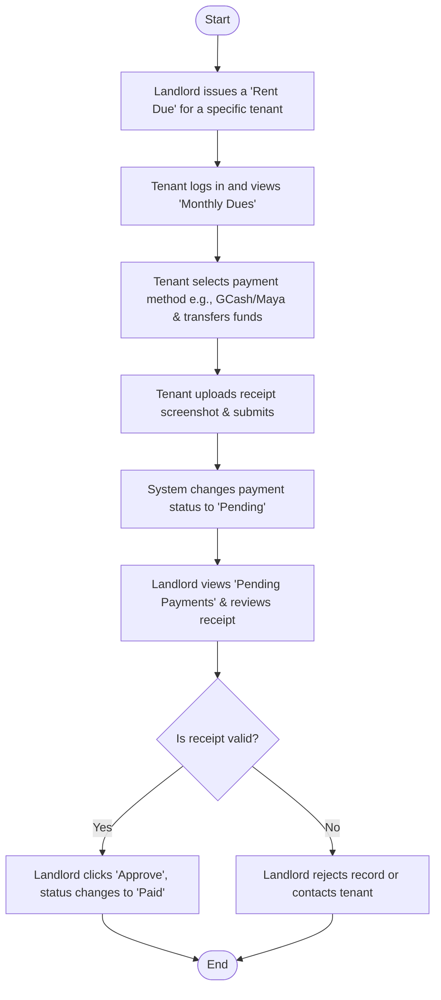
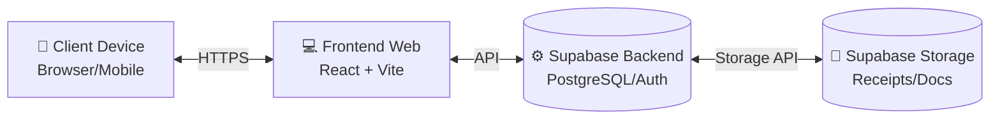

# 🏢 BoardEase: Boarding House Management System

**Prepared by:** Jerick Dacera / BoardEase Team  
**Date:** May 2026  

---

## 📖 Introduction

The manual management of boarding houses often involves tedious record-keeping, delayed rent collections, and inefficient communication between landlords and tenants. **BoardEase** is a comprehensive, web-based Boarding House Management System designed to streamline these operations. 

It provides a centralized platform for landlords to manage their properties, track tenant payments, handle maintenance requests, and broadcast announcements. Simultaneously, it empowers tenants with a dedicated portal to view their monthly dues, submit payments via digital receipts (GCash, Maya, etc.), and raise maintenance concerns effortlessly. By digitizing these processes, BoardEase minimizes administrative overhead, reduces human error, and fosters a transparent, organized living environment.

---

## 🎯 Objective of the Study

### General Objective
To design, develop, and implement a web-based Boarding House Management System that automates and centralizes the administration of boarding house operations, financial tracking, and tenant relations.

### Specific Objectives
1. **Landlord Portal:** To develop a portal for managing rooms, tracking tenant profiles, and monitoring portfolio statistics.
2. **Tenant Portal:** To create a secure portal that allows users to view their specific monthly breakdown (Base Rent, Electricity, Water) and submit payment proofs.
3. **Maintenance Tracking:** To implement a digital ticketing system for tracking and resolving maintenance requests.
4. **Digital Payments:** To integrate a payment tracking mechanism supporting e-wallets (GCash, Maya) and traditional methods via receipt validation.
5. **Real-time Analytics:** To generate real-time dashboards for landlords reflecting total revenue, overdue payments, and vacant rooms.

---

## 🔍 Scope & Limitations

### ✅ Scope
- **User Roles:** The system supports two primary user roles: **Landlords** and **Tenants**.
- **Property Management:** Landlords can add, edit, and delete rooms, as well as assign tenants to specific rooms.
- **Financial Management:** The system handles the creation of monthly dues, tracking of payments, and approval of uploaded digital receipts (GCash/Maya) by the landlord.
- **Maintenance Tickets:** Tenants can submit maintenance requests, which landlords can view and mark as resolved.
- **Announcements:** Landlords can broadcast announcements visible to all registered tenants.
- **Platform:** The system is a responsive web application accessible via desktop and mobile web browsers.

### ⚠️ Limitations
- **Payment Gateway Integration:** The system does not automatically process transactions (e.g., auto-debit or direct APIs). Payments are made manually by the tenant via GCash/Maya apps, and a receipt screenshot must be uploaded for the landlord to manually verify and approve.
- **Hardware Integration:** The system does not integrate with physical boarding house hardware (e.g., smart locks, RFID gates, or digital sub-meters for electricity/water).
- **Offline Capability:** The system requires an active internet connection to function as it relies on cloud database services (Supabase).

---

## 📚 Definition of Terms

- **BoardEase:** The name of the proposed Boarding House Management web application.
- **Landlord:** The property owner or administrator who manages the boarding house, tenants, and collects payments through the system.
- **Tenant:** A registered user who rents a room within the boarding house and uses the system to pay dues and submit tickets.
- **Monthly Dues:** The financial obligation of a tenant for a specific month, which may include base rent and utility splits.
- **Maintenance Ticket:** A digital request submitted by a tenant regarding repairs or issues in their room or the facility.
- **Supabase:** The cloud backend-as-a-service (BaaS) used by the system for database management (PostgreSQL), user authentication, and file storage (receipts).
- **Dashboard:** The main user interface that displays a summary of data, such as revenue, vacant rooms, and recent activity.

---

## 🔄 SDLC (Software Development Life Cycle)

The project utilizes the **Agile Methodology** to allow for iterative development and continuous feedback.

1. **Planning & Requirement Analysis:** Gathering requirements from typical boarding house scenarios, defining the user roles (Landlord vs. Tenant), and establishing the core features (payments, rooms, tickets).
2. **Design:** Creating UI/UX mockups focusing on a modern, clean, and responsive dashboard. Designing the Supabase relational database schema (tables for profiles, boarding_houses, rooms, tenants, payments, tickets).
3. **Development (Implementation):** Coding the frontend using React, Vite, and Tailwind CSS. Integrating the frontend with Supabase for real-time data fetching, authentication, and storage.
4. **Testing:** Conducting unit and integration testing to ensure payments reflect correctly, receipts upload successfully, and role-based access control prevents tenants from accessing landlord data.
5. **Deployment:** Hosting the web application on a cloud platform (e.g., Vercel) and the database on Supabase.
6. **Maintenance:** Gathering user feedback, fixing bugs, and deploying minor feature updates.

---

## 💻 Requirements Analysis

### 🛠️ Hardware Requirements

**For Development:**
- Minimum Intel Core i5 or AMD Ryzen 5 processor
- 8GB RAM (16GB recommended)
- 256GB SSD storage
- Internet connection

**For Users (Landlords/Tenants):**
- Any smart device (Smartphone, Tablet, Laptop, or Desktop PC)
- An active Internet connection

### 🧰 Software Requirements

**For Development:**
- **Frontend Framework:** React 18 with TypeScript and Vite
- **Styling:** Tailwind CSS, Shadcn UI, Lucide React (Icons)
- **Backend/Database:** Supabase (PostgreSQL, Auth, Storage)
- **Code Editor:** Visual Studio Code
- **Version Control:** Git & GitHub

**For Users (Landlords/Tenants):**
- Any modern web browser (Google Chrome, Mozilla Firefox, Safari, Microsoft Edge). *No standalone mobile app installation required.*

---

## 🏗️ System Design

### 🔀 Payment Verification Flow

### 🧱 Architecture Block Diagram

### 🧩 Core Components
- **Auth Component:** Handles Sign Up, Login, and secure routing based on user roles.
- **Landlord Dashboard Component:** Aggregates data to show revenue, vacancy rates, and recent activities.
- **Tenant Dashboard Component:** Displays current balance, recent announcements, and active tickets.
- **Payment Component:** Contains the UI for issuing bills (Landlord) and uploading receipts (Tenant).
- **Room Management Component:** Allows CRUD operations for boarding house rooms.
- **Ticketing Component:** Manages the creation, tracking, and resolution of maintenance requests.

---

## 📖 User Manual

### 👑 For Landlords
1. **Registration & Login:**
   - Navigate to the registration page, select "Register as Landlord", and fill in your property details.
   - Log in using your email and password.
2. **Managing Rooms:**
   - Go to the **Rooms** tab to add new rooms, set capacity, and define base rent.
3. **Managing Tenants:**
   - Go to the **Tenants** tab. Here you can add new tenants and assign them to specific rooms.
4. **Collecting Payments:**
   - Go to the **Payments** tab. Click "Issue Due" to generate a bill for a tenant.
   - When a tenant uploads a receipt, the status will show as "Pending". Click "View Receipt" to verify, then click "Approve" to mark it as Paid.
5. **Handling Tickets:**
   - Check the **Tickets** tab for any maintenance issues raised by tenants. You can update the status to "Done" once resolved.

### 👤 For Tenants
1. **Login:**
   - Use the credentials provided by your landlord or register if instructed.
2. **Viewing & Paying Dues:**
   - Go to the **Pay** tab to see your current Monthly Dues.
   - Scan the Landlord's GCash/Maya QR code or copy their number to make a payment on your respective e-wallet app.
   - Screenshot your transaction, upload it in the "Upload Receipt" field, and enter the exact amount paid. Click Submit.
3. **Submitting Maintenance Requests:**
   - Go to the **Requests** or **Tickets** tab.
   - Click "New Request", describe your issue (e.g., leaking faucet), and submit. You can track its status here.
4. **Viewing History:**
   - Go to the **Receipts** tab to view all your past approved and pending payments.
